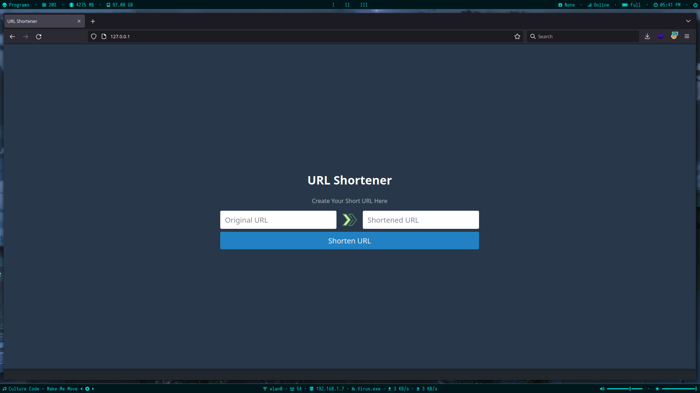

# What is URL Shortener?

URL shortening is a technique on the World Wide Web in which a Uniform Resource Locator may be made substantially shorter and still direct to the required page. 
This is achieved by using a redirect which links to the web page that has a long URL.

# How to use this image

## Simple usage:

`docker run --name shortener -d alirn76/url-shortener:v1.3`

## Options:

### Publish: 
Instance starts at **port 8000**, so you can publish it in any port you want.

### WORKER:
 **Default** is `2`

Instance starts with how many workers

### BASE\_URL:

**Default** is [_http://127.0.0.1:8000_](http://127.0.0.1:8000)

**Usage:**
-   1. Show the _Shortened URL_ for copy 
-   2. Check the _Original URL_ if `PRIVATE` is `true`

### PRIVATE:

**Default** is `false`

Check the `BASE_URL` in _Original URL_
> _It won't work correct if `BASE_URL` is ip_ 

**example**:

`BASE_URL` = https://alirn.ir

- `Original URL` = https://google.com/something/  --> `Not Valid`
- `Original URL` = https://alirn.ir/something --> `OK`
- `Original URL` = http://alirn.ir/something --> `OK`
- `Original URL` = https://api.alirn.ir/something --> `OK`
- `Original URL` = https://alirn.ir.google.com/ --> `Not Valid`
    

### TITLE:

**Default** is `"URL Shortener"`

Used to show the **Title** of page _(you can put you website name in it)_

### DESCRIPTION:

**Default** is `"Create Short & Memorable URL In a Seconds."`

## Full-featured usage:

`docker run --name shortener --restart always -p 80:8000 -e WORKER=1 -e BASE_URL=https://example.com -e PRIVATE=true -e TITLE="URL Shortener" -e DESCRIPTION="Create Your Short URL Here" -d alirn76/url-shortener:v1.3`

## Persistent Storage:

-   1.  Create docker volume → `docker volume create shortener-volume`
-   2. Add volume to you run command → `--volume shortener-volume:/shortener/database`

## Demo:

> ### Source Code → [https://github.com/AliRn76/shortener](https://github.com/AliRn76/shortener)

> ### Docker Image → [https://hub.docker.com/r/alirn76/url-shortener](https://hub.docker.com/r/alirn76/url-shortener)

> ### Thanks to [MohammadReza Shahbazi](https://www.linkedin.com/in/mohammadrezashahbazi/) for Frontend